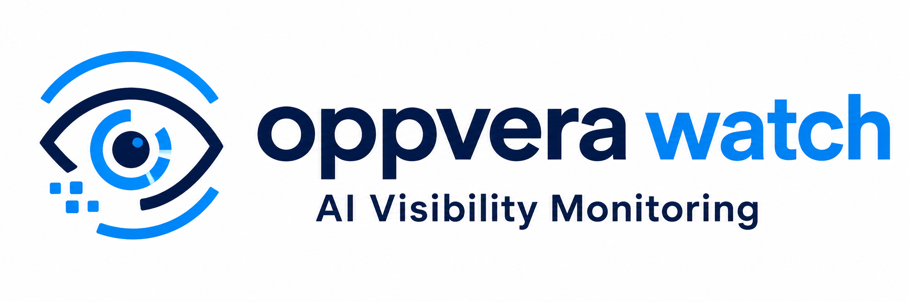

<p align="center">
  
</p>

# Oppvera Watch — Learn GEO & AI Visibility

**Oppvera Watch** is an open-source educational fork of [OneGlanse](https://github.com/aryamantodkar/oneglanse). It is built for **marketing staff and GEO learners** who want hands-on practice—not only for developers.

Run it on your Mac or Windows laptop to learn **GEO (Generative Engine Optimization)** and **AI visibility**: how brands show up inside ChatGPT, Gemini, Perplexity, Claude, and Google AI Overview.

This repo is meant for learners, instructors, and marketing teams experimenting with real AI product surfaces.

## What you'll learn

- **GEO measurement on real UIs.** The app opens provider chat interfaces in a browser (like a signed-in user), not model APIs. You see citations, source cards, and ranking the way users do.
- **How visibility scores are built.** Captured answers are analyzed with your own OpenAI or Anthropic key. Scores combine visibility, rank, sentiment, and recommendation for a workspace brand.
- **Self-hosted data flow.** Background databases run on your machine via Docker Desktop. Responses and analytics stay local.

Upstream [OneGlanse docs](https://docs.oneglanse.com) explain the full product. This fork adds educational framing, marketing-friendly install guides, and removes upstream PostHog telemetry.

## Status

- **Synced with upstream:** This branch includes the latest [OneGlanse](https://github.com/aryamantodkar/oneglanse) changes through the current merge base, plus Oppvera Watch tweaks (branding, telemetry removal, install notes).
- **Install is still manual.** You need Node.js, pnpm, Docker Desktop, and Git today. We plan to simplify this for marketing users over time—expect rough edges for now.

## Quick start

**New to local setup?** Start with the full walkthrough: **[Local setup guide](docs/local-setup.mdx)** (written for marketing and GEO learners).

### Before you run anything

Install these once on your Mac or Windows laptop:

| Tool | Why you need it |
| --- | --- |
| [Node.js 20+](docs/local-setup.mdx#install-nodejs) | Runs the app |
| [pnpm 10+](docs/local-setup.mdx#install-pnpm) | Installs the project |
| [Docker Desktop](docs/local-setup.mdx#install-docker-desktop) | Runs background databases—**keep it open while using the app** |
| [Git](docs/local-setup.mdx#install-git) | Downloads the project |
| OpenAI or Anthropic API key | Scores captured AI answers |

**WSL is not supported** for provider sign-in. Use native macOS or native Windows.

### Run the app

After the tools above are installed and Docker Desktop is running:

```bash
git clone https://github.com/codetricity/oppvera-watch.git
cd oppvera-watch
cp .env.example .env
```

Add one analysis LLM key to `.env` (open the file in any text editor):

```bash
OPENAI_API_KEY=sk-...
```

or:

```bash
ANTHROPIC_API_KEY=sk-ant-...
ANALYSIS_LLM_PROVIDER=claude
```

Then:

```bash
pnpm local
```

Open [http://localhost:3000](http://localhost:3000). First run can take several minutes.

1. Sign up with email (local to your machine).
2. Connect providers at `/providers`. Finish sign-in in the browser window that opens, then close it.
3. Create a workspace with the brand you want to score.
4. Add prompts and start a run from Workspace Runs.

Do not commit `.env`; it contains API keys.

## How it works

It does **not** call ChatGPT / Gemini / Claude / Perplexity model APIs to collect answers.

It opens the real product UIs in a browser and captures what renders: the answer, citations, source cards, and brand order. After capture, it uses **your** OpenAI or Anthropic key to score those answers for GEO visibility, sentiment, rank, and recommendation.

GEO scores are about the **workspace brand** (name + domain), not whether the model answered the prompt. If the brand is absent, scores stay empty even when ChatGPT returned a full response.

Scoring uses the prompt in [`packages/services/src/analysis/analysisPrompt.ts`](packages/services/src/analysis/analysisPrompt.ts). Upstream details: [OneGlanse README](https://github.com/aryamantodkar/oneglanse).

## Technical stack (optional)

For developers who want the underlying architecture:

| Layer | Technology |
| --- | --- |
| Web app | Next.js 15, React 19, tRPC, Drizzle ORM |
| Browser worker | Camoufox, Playwright, BullMQ |
| Analytics DB | ClickHouse |
| Relational DB | PostgreSQL 16 |
| Queue | Redis |
| Auth | Better Auth |
| Response analysis | OpenAI or Anthropic (your key) |

## Telemetry

Upstream OneGlanse sends anonymous hashed user-activity events to PostHog on signup and each authenticated page load. **This fork removes that.** Oppvera Watch does not phone home to OneGlanse or PostHog.

Better Auth (the auth library) may still perform its own internal telemetry as part of the dependency. That is separate from the OneGlanse PostHog integration removed here.

## Origin and attribution

Oppvera Watch is a modification of **[OneGlanse](https://github.com/aryamantodkar/oneglanse)** by [Aryaman Todkar](https://github.com/aryamantodkar).

- Original project: [github.com/aryamantodkar/oneglanse](https://github.com/aryamantodkar/oneglanse)
- Original site: [oneglanse.com](https://oneglanse.com)
- Original docs: [docs.oneglanse.com](https://docs.oneglanse.com)

Most architecture, capture logic, and scoring design come from OneGlanse. Oppvera Watch changes focus on educational use, local install, and privacy (no PostHog).

**Trademark note:** "OneGlanse" is the upstream project name. Oppvera Watch is an independent educational fork—not an official OneGlanse release. Please say so in courses and videos.

## Documentation

Oppvera Watch setup starts in this README. Deeper reference material lives in `docs/`:

- [Introduction](docs/introduction.mdx) — what GEO measurement means in this tool
- [Getting started](docs/getting-started.mdx) — start here for marketing / GEO learners
- [Local setup](docs/local-setup.mdx) — **full install guide** (Node.js, pnpm, Docker Desktop, Git on Mac and Windows)
- [Self-hosted setup](docs/self-hosted-setup.mdx)
- [Environment variables](docs/environment-variables.mdx)
- [Troubleshooting](docs/troubleshooting.mdx)
- [API reference](docs/api-reference.mdx)

These pages are Mintlify source inherited from upstream OneGlanse and rebranded for Oppvera Watch. Install and onboarding here may change over time. The browsable upstream version is at [docs.oneglanse.com](https://docs.oneglanse.com).

## License

This project is **MIT licensed**. See [LICENSE](LICENSE).

### Using this in educational videos

The MIT license allows you to:

- Run, screen-record, and demonstrate the software
- Fork, modify, and share copies
- Use it in free or paid courses

You must:

- Keep the MIT copyright and permission notice (in `LICENSE` and substantial copies)
- Credit the original author: **Aryaman Todkar / OneGlanse**
- Credit this fork's modifications: **Craig Oda / Oppvera Watch**

Suggested on-screen or description credit:

> Based on [OneGlanse](https://github.com/aryamantodkar/oneglanse) (MIT) and [Oppvera Watch](https://github.com/codetricity/oppvera-watch) (MIT).

### Dependencies

Application code is MIT. Third-party packages (Camoufox, Playwright, Next.js, ClickHouse client, etc.) ship under their own licenses in `node_modules` and upstream notices. OneGlanse's README lists major dependency acknowledgements.

## Acknowledgements

OneGlanse builds on Camoufox, Playwright, BullMQ, ClickHouse, Drizzle, Better Auth, and Turndown. See the [original project README](https://github.com/aryamantodkar/oneglanse) for those licenses.
