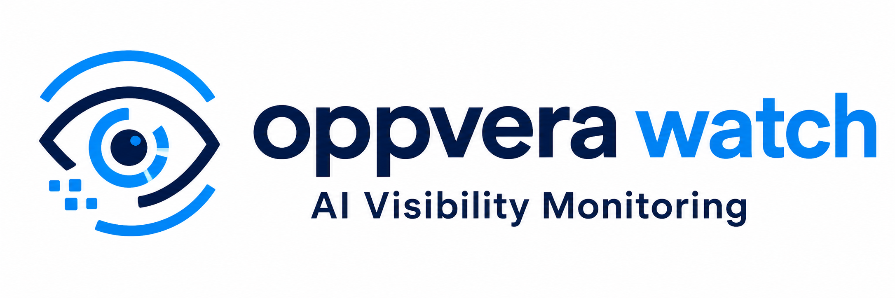

# Oppvera Watch

**Oppvera Watch** is a **macOS capture client** for [Oppvera](https://oppvera.com). It opens real consumer AI product UIs (ChatGPT, Claude, Gemini, Perplexity, Google AI Overview), records what those pages render, and uploads **answer text and citations** to a paired campaign.

GEO scores, dashboards, and query-bank editing live on **hosted Oppvera**. This app does not score, chart, or store analytics locally.

The capture engine started as an educational fork of [OneGlanse](https://github.com/aryamantodkar/oneglanse). The product no longer is OneGlanse: there is no local Next.js dashboard, no Docker stack, and no analysis API key on the laptop.

## What Watch is (and is not)

| | Watch (this repo) | Probe (hosted Oppvera) |
| --- | --- | --- |
| Observes | Consumer **product UIs** in a browser on your Mac | **LLM / web-search APIs** with Oppvera's keys |
| Runs on | Your Mac (Electron + Camoufox/Firefox) | Oppvera servers |
| You pay for capture | Your ChatGPT / Claude / etc. **consumer** plan | Oppvera's API budget |
| Scoring | After sync, on Oppvera | On Oppvera |
| Cookies / logins | Stay on this Mac. Never uploaded. | None (API, not your ChatGPT password) |

Watch is not "free ChatGPT API." You sign into the consumer apps you already use. Watch automates those UIs and syncs the rendered answers.

A third surface, **Studio / Brand Security**, diagnoses owned content in Oppvera's retrieval lab. It does not predict ChatGPT.

## Status

- **Desktop v1 (in progress):** macOS Electron app in `apps/desktop`, currently **v0.2.0**. Pairing, provider Connect, signed-in query-bank runs, Stop, and sync to Oppvera `source=watch`.
- **Hosted ingest:** Oppvera pairing tokens and `POST /api/probe/captures` (Oppvera v0.95.0+).
- **Windows:** planned as desktop v2. Linux desktop is not on the roadmap.
- **Not the install path:** `pnpm local`, Docker Desktop, Postgres/Redis/ClickHouse, Better Auth, and `OPENAI_API_KEY` on this machine. Those remain in the monorepo as leftover OneGlanse packages. Do not follow them to run Watch.

This repo does **not** routinely merge OneGlanse. The `oneglanse` git remote is fetch-only for optional capture-engine patches.

## How it works

1. In Oppvera, open the campaign **Visibility** page and generate a pairing code.
2. In Watch, paste the Oppvera base URL (`https://oppvera.com` or local `http://127.0.0.1:8000`) and the code. Pairing survives app restarts until you unpair.
3. Install **Python 3.10+** from [python.org](https://www.python.org/downloads/) if needed, then use **Set up Camoufox Python** once so Firefox can launch.
4. On **Providers**, Connect with the consumer accounts you already pay for. Disconnect removes the saved login from this Mac. It does not reset Oppvera.
5. **Query bank** is read-only here. Add or edit questions in Oppvera.
6. On **Run**, pick connected providers. Stop kills the capture process, including Firefox.
7. **Sync** uploads pending captures. Oppvera scores them. Watch never asks for an analysis key.

Packaged `.dmg` users do not need Node.js. Developers running from git do (see below).

## Requirements

| Who | Need |
| --- | --- |
| Anyone capturing | macOS, Python 3.10+, network, an Oppvera campaign + pairing code |
| Signed-in captures | Your consumer logins in the Camoufox window (Connect before Run) |
| Developers from this repo | Node.js 20+, pnpm 10+, Git |

Docker is not required for Watch.

Automated access to provider UIs may conflict with those products' terms. You start the run and see the browser. Compliance is your responsibility.

## Develop from this repo

```bash
git clone https://github.com/oppvera/oppvera-watch.git
cd oppvera-watch
pnpm install
pnpm dev:desktop
```

Pair against `https://oppvera.com` or a local Oppvera (`http://127.0.0.1:8000`).

pnpm 10 skips dependency build scripts by default. This repo allowlists Electron. If the app crashes with a missing `Electron Framework.framework`, run `pnpm dev:desktop` again so it can re-download the binary.

More detail: [apps/desktop/README.md](apps/desktop/README.md).

### Package a dmg

```bash
pnpm --filter @oppvera/watch-desktop dist:mac
```

v1 packaging is ad-hoc signed arm64. Capture still expects this git checkout (Camoufox + agent). A fully standalone installer is later work.

## Data that stays on the Mac

Under `~/Library/Application Support/Oppvera Watch/`:

- Playwright session files (cookies / `storageState`)
- Device pairing token
- Unsynced capture files

Watch uploads question text, answer markdown, citations, provider labels, and ids. It **never** uploads cookies, `storageState`, passwords, or localStorage dumps.

The desktop app does not send product analytics to PostHog or OneGlanse. Scoring happens on Oppvera after you sync. Hosted Oppvera may use its own analytics independently of this Mac app.

## Documentation

- [apps/desktop/README.md](apps/desktop/README.md) — desktop develop and package notes
- [docs/plans/README.md](docs/plans/README.md) — Watch / Probe / Studio split and implementation specs (not a consumer install guide)

Mintlify pages under `docs/*.mdx` (local Docker setup, self-host, environment variables) describe the **old** OneGlanse-style stack. They are not how you run Oppvera Watch today.

## License

This project is **MIT licensed**. See [LICENSE](LICENSE).

### Using this in educational videos

The MIT license allows you to run, screen-record, fork, and use the software in free or paid courses. You must keep the MIT copyright notice and credit:

- Original capture project: **Aryaman Todkar / OneGlanse**
- This fork and desktop product: **Craig Oda / Oppvera Watch**

Suggested credit:

> Based on [OneGlanse](https://github.com/aryamantodkar/oneglanse) (MIT) and [Oppvera Watch](https://github.com/oppvera/oppvera-watch) (MIT).

**Trademark note:** "OneGlanse" is the upstream project name. Oppvera Watch is an independent fork and is not an official OneGlanse release.

### Dependencies

Application code is MIT. Camoufox, Playwright, Electron, and other packages ship under their own licenses. OneGlanse's README lists major acknowledgements for the shared capture stack.
